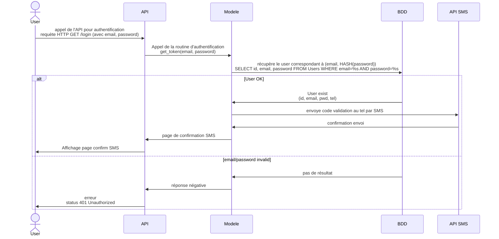
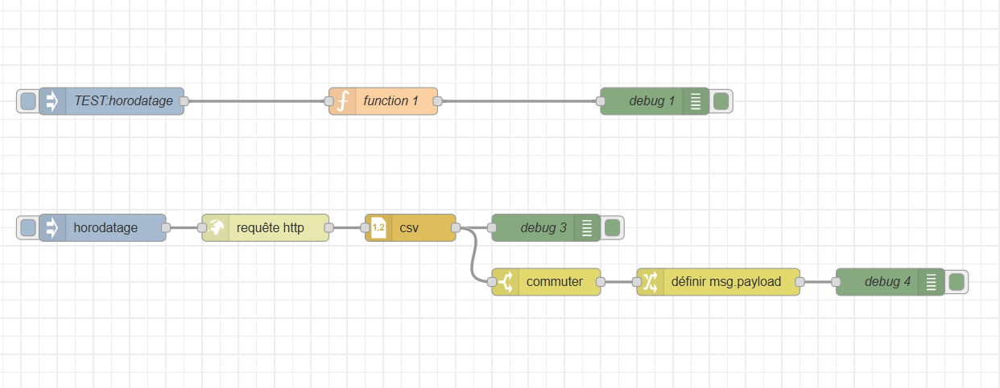
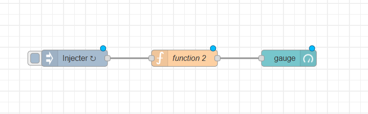
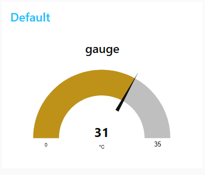

# IoT

## Les diagrammes

```mermaid
%% Example of sequence diagram
sequenceDiagram
    actor User as User
    participant API as API
    participant Modele as Modele

    User ->> API: appel de l'API pour authentification<br>requète HTTP GET /login (avec email, password)
    API ->> Modele: Appel de la routine d'authentification<br>get_token(email, password)
    Modele ->> BDD : récupère le user correspondant à (email, HASH(password))<br>SELECT id, email, password FROM Users WHERE email=%s AND password=%s

    alt User OK
        BDD ->> Modele : User exist<br>(id, email, pwd, tel)
        Modele ->> API SMS: envoye code validation au tel par SMS
        API SMS->>Modele : confirmation envoi
        Modele->>API: page de confirmation SMS
        API->>User : Affichage page confirm SMS


    else email/password invalid
        BDD ->> Modele: pas de résultat
        Modele ->> API : réponse négative
        API->>User : erreur<br>status 401 Unauthorized
    end
```

## Les Flux

